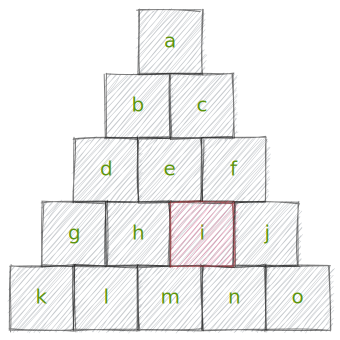
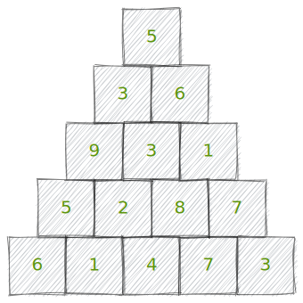
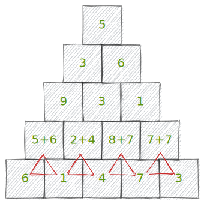
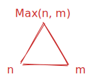
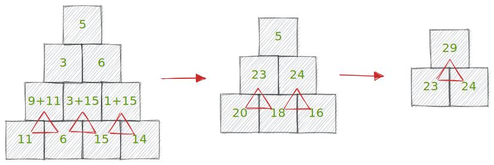

<!--  -->

# Challenge 18: Maximum path sum

  

  

  To find the best path, i'll start from bottom to top.

  I can write a generic position i described by a row L (where 'L' is the penultimate line) and a column col.

  The maximum value between L+1[col] and L+1[col + 1] (m and n in the image) will be the best path that passes through i.

  In other words, if a path reached 'i', regardless of how, the best option is the maximum between m and n.

  So I can transform my triangle of size 'n' to a triangle of size 'n-1' by adding the maximum to the top row.

  To make it clearer, i'll 
  show a numeric example.

  

  

  

  For this example, i'll use a triangle with only 5 lines, resulting in 16 possibilities, wich is very easy to do by brute force, but it's just to show my reasoning.

  In this case, the generic 'i' is the number 8. Once the path reached it, regardless of the path above, the best option is the maximum value between 4 and 7 (m and n).

  So, i'll sum the number 7 to our 8 and do this with all of numbers of this line, like showed in the next image

  

  

  

  Here the program must take the numbers in the last line, two by two, and find the maximum between them (Max(x, y)). Then, the programn will sum it to the corresponding number in the penultimate line, and so successively.

  This process is represented by the red triangle:

   

  

  

  

  

  ## The biggest path sum results in 29, regardless of the path taken  
  
  

